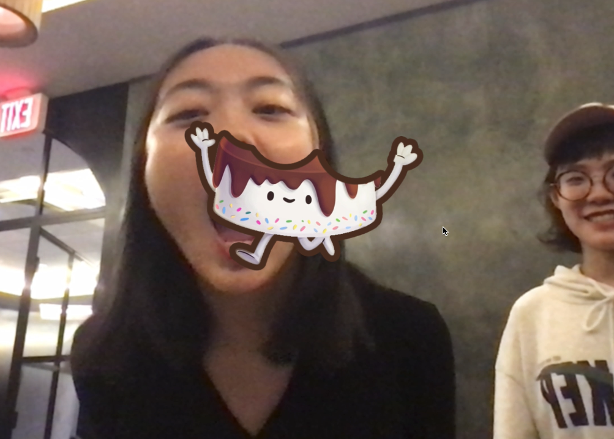

# Birthday Surprise App
 I made this app as a birthday gift for my best friend. I was trying to create an super interesting and surprising digital experience for her on her birthday party. Finally I came up with this playful cake eating expeirence and achieved it with p5js and ml5 facemesh API. I also use anima.js to animate the fonts.
 
 Sound effect by Yunfei Song (myself).
 Background music by Musom Hu.
 
 
 
 
